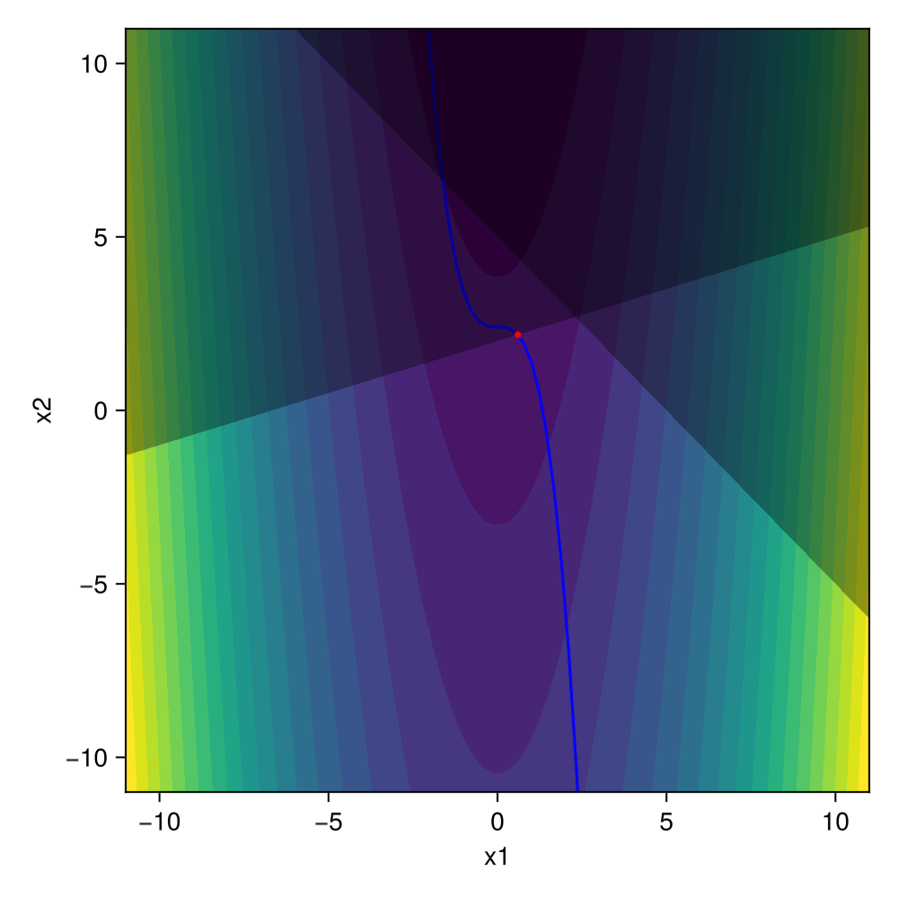

# NLPSaUT

The `NLPSaUT` module constructs a `JuMP` `model` for a generic nonlinear program (NLP).
The expected use case is solving a differentiable (either analytically or numerically) nonconvex NLP with gradient-based algorithms such as Ipopt or SNOPT. 

The user is expected to provide a "fitness function" ([pygmo](https://github.com/esa/pygmo2)-style), which evaluates the objective, equality, and inequality constraints. Below is an example: 

```julia
function f_fitness(x::T...) where {T<:Real}
    # compute objective
    f = x[1]^2 - x[2]
    
    # equality constraints
    h = zeros(T, 1)
    h = x[1]^3 + x[2] - 2.4

    # inequality constraints
    g = zeros(T, 2)
    g[2] = -0.3x[1] + x[2] - 2   # y <= 0.3x + 2
    g[1] = x[1] + x[2] - 5      # y <= -x + 5
    return [f; h; g]
end
```

Derivatives of `f_fitness` is taken using `ForwardDiff.jl` (which is the default `JuMP` behavior according to its [docs](https://jump.dev/JuMP.jl/stable/tutorials/nonlinear/operator_ad/#Gradient)); as such, `f_fitness` should be written in a way that is compatiable to `ForwardDiff.jl`. 
For reference, here's the [JuMP docs page on common mistakes when using `ForwardDiff.jl`](https://jump.dev/JuMP.jl/stable/manual/nonlinear/#Common-mistakes-when-writing-a-user-defined-operator). 

The `model` constructed by `NLPSaUT` utilizes `memoization` to economize on the fitness evaluation (see [JuMP Tips and tricks on NLP](https://jump.dev/JuMP.jl/stable/tutorials/nonlinear/tips_and_tricks/)). 

## Quick start

1. `git clone` this repository
2. start julia-repl
3. activate & instantiate package (first time)

```julia-repl
pkg> activate .
julia> using Pkg                # first time only
julia> Pkg.instantiate()        # first time only
```

4. run tests

```julia-repl
(NLPSaUT) pkg> test
```

### Note

- To use with SNOPT, it's probably better to go through [`GAMS.jl`](https://github.com/GAMS-dev/gams.jl?tab=readme-ov-file) rather than to use [`SNOPT7.jl`](https://github.com/snopt/SNOPT7.jl) directly (installing `SNOPT7.jl` currently errors on julia v1.10)


## Examples

For examples, see the `examples` directory.




## TODO notes

- Development
    - [ ] Finite difference gradient option
    - [ ] Analytical gradient option

- Examples
    - [x] Simple example with Ipopt
    - [ ] Simple example with SNOPT via GAMS
    - [ ] Example with astrodynamics (e.g. Lambert problem)
